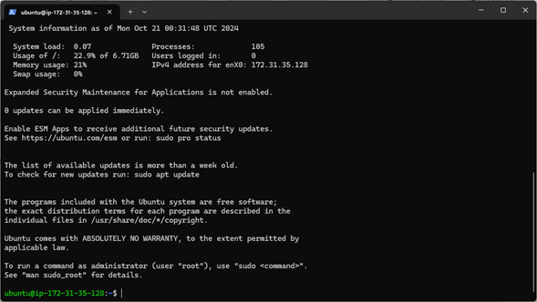
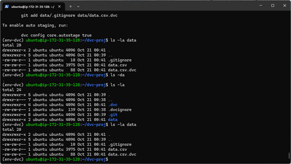
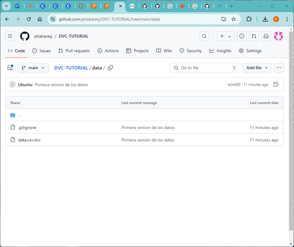
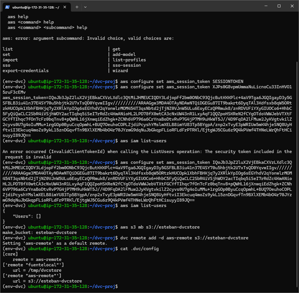
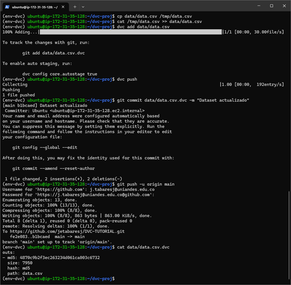
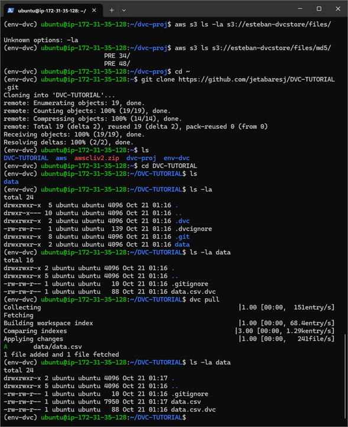
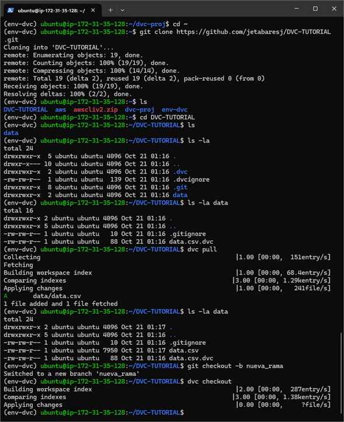

# Taller - Data Version Control (DVC)

### Introducción

En este taller se utilizó **DVC**, una herramienta que complementa Git y permite versionar datos y modelos en proyectos de ciencia de datos. Esto garantiza la reproducibilidad y la trazabilidad de los datos y modelos durante el desarrollo. Se utilizó una instancia de EC2 en AWS para realizar el despliegue de este sistema.

### 1. Configuración de la instancia EC2

Para comenzar, se lanzó una instancia de EC2 en AWS con las siguientes características:

- **Nombre**: Taller-DVC
- **AMI**: Ubuntu Server 24.04 LTS (HVM)
- **Tipo de instancia**: t2.micro
- **Almacenamiento**: 10 GB SSD
- **Llave SSH**: Creada y guardada como `llave.pem`

A continuación, se conectó a la instancia EC2 utilizando SSH:

```bash
ssh -i /path/to/llave.pem ubuntu@<IP_de_la_instancia>
```



---

### 2. Instalación de DVC y dependencias

Dentro de la instancia, se verificó la instalación de Python y se instalaron los paquetes necesarios, incluyendo `pip` y `venv` para la creación de entornos virtuales. Se creó un entorno virtual para DVC y se activó.

```bash
sudo apt update
sudo apt install python3-pip
sudo apt install python3.12-venv
python3 -m venv /home/ubuntu/env-dvc
source env-dvc/bin/activate
```

Con el entorno activado, se procedió a instalar **DVC** con soporte para AWS S3:

```bash
pip install "dvc[s3]"
```

Se verificó la instalación de Git para manejar el versionado de los archivos.

---

### 3. Creación del proyecto con DVC

Dentro de la instancia, se creó un directorio para el proyecto DVC y se inicializó tanto un repositorio de Git como uno de DVC:

```bash
mkdir ~/dvc-proj
cd ~/dvc-proj
git init
git branch -m main
dvc init
```

Se descargó un dataset de prueba, el famoso dataset `iris.csv`, y se colocó en una carpeta `data/`. Posteriormente, se agregó el archivo a DVC.

```bash
mkdir -p data
curl https://gist.githubusercontent.com/netj/8836201/raw/6f9306ad21398ea43cba4f7d537619d0e07d5ae3/iris.csv -o data/data.csv
dvc add data/data.csv
```


---

### 4. Conexión con GitHub y envío del proyecto

Se creó un repositorio remoto en GitHub y se vinculó el proyecto local:

```bash
git remote add origin https://github.com/usuario/nombre_repo.git
git push -u origin main
```


---

### 5. Gestión de datos remotos: Almacenamiento local y S3

Primero se configuró un almacenamiento remoto local utilizando una carpeta en `/tmp`:

```bash
mkdir /tmp/dvcstore
dvc remote add -d fuentelocal /tmp/dvcstore
dvc push
```

Posteriormente, se configuró un bucket en S3 para almacenar los datos y se agregó como otro remote:

```bash
aws s3 mb s3://nombre-dvcstore
dvc remote add -d aws-remote s3://nombre-dvcstore
dvc push
```


---

### 6. Versionado de datos

Se simuló la actualización de los datos duplicando el dataset, y se agregó esta nueva versión a DVC:

```bash
cp data/data.csv /tmp/data.csv
cat /tmp/data.csv >> data/data.csv
dvc add data/data.csv
dvc push
```

Finalmente, se agregó esta nueva versión al repositorio Git:

```bash
git commit -m "Dataset actualizado"
```





---


### Conclusión

Este taller permitió conocer el uso de **DVC** para gestionar y versionar datasets y modelos de machine learning de manera eficiente. Se exploraron las conexiones locales y con S3 como almacenamiento remoto, y se comprendió cómo DVC ayuda a gestionar grandes volúmenes de datos mientras se mantiene un control de versiones claro.

Adicionalmente se realiza el trabajo de checkout


---

### Repositorio GitHub

[Enlace al repositorio](https://github.com/jetabaresj/DVC-TUTORIAL)
